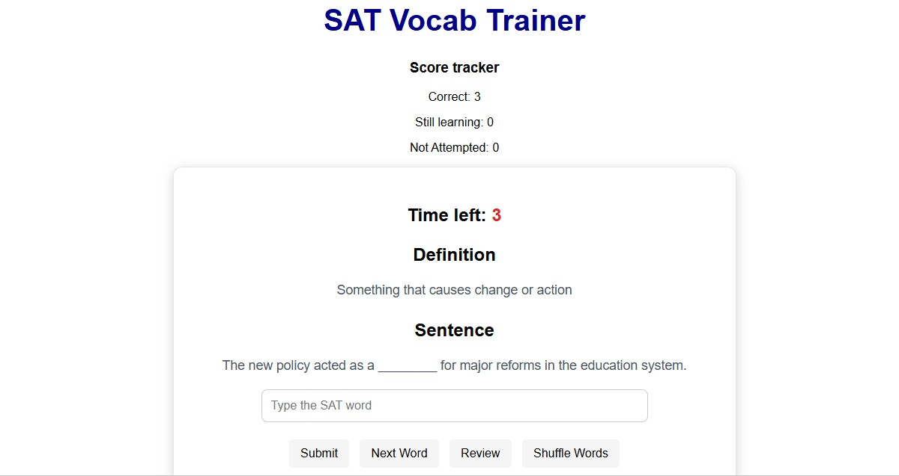
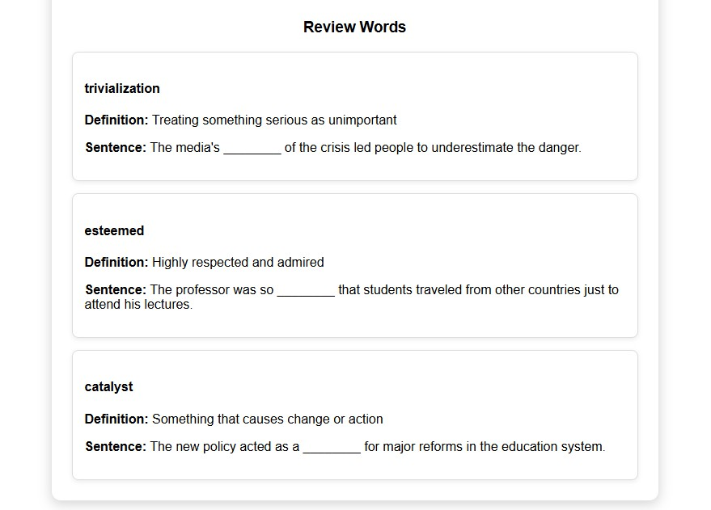

# SAT Vocabulary Trainer

An interactive web application that helps students practice SAT vocabulary through timed exercises, progress tracking, and review sessions.

## Why I built this project

While studying for the SAT, I found that memorizing long vocabulary lists was repetitive, boring, and ineffective. I wanted a way to actively practice words and track the vocabulary I still needed to review. Since I had been learning web development, I decided to build my own study tool.

This project combines two of my interests: SAT preparation and programming. Building this application allowed me to reinforce my JavaScript skills while creating a tool that supports my own learning process.

## Features

- Timed practice sessions with a 15-second countdown  
- 100+ SAT vocabulary words with definitions and example sentences
- Instant feedback on answers  
- Recognition of close answers through synonyms  
- Score tracking (correct, still learning, not attempted)  
- Review mode for words marked as “still learning”  
- Randomized word order using a shuffle algorithm  
- Keyboard support (press Enter to submit)  
- Progress saved using local storage  

## Screenshots

### Main Interface

### Review Mode

## Technologies Used

- HTML
- CSS
- JavaScript
- Browser Local Storage API  

## Programming Concepts Demonstrated

- Arrays and objects  
- DOM manipulation  
- Event listeners  
- Functions and modular design  
- Timers with `setInterval()`  
- Array methods (`filter()`, `find()`, `includes()`)  
- Fisher–Yates shuffle algorithm  
- Data persistence using local storage  

## Future Improvements

- Expand the vocabulary database  
- Add spaced repetition review sessions  
- Include accuracy statistics and progress charts  
- Add difficulty levels  
- Implement dark mode  
- Allow users to create custom vocabulary lists  

## How to Run

1. Download or clone the repository  
2. Open `index.html` in your browser  
3. Type the SAT word that matches the definition and sentence  
4. Use review mode to revisit words that need additional practice  
5. Progress is automatically saved in the browser  

## Author

Created by Alex F. as a personal project combining SAT preparation and web development.

